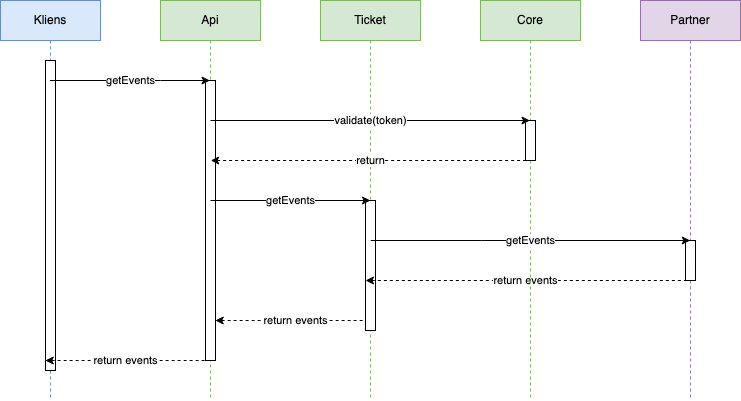
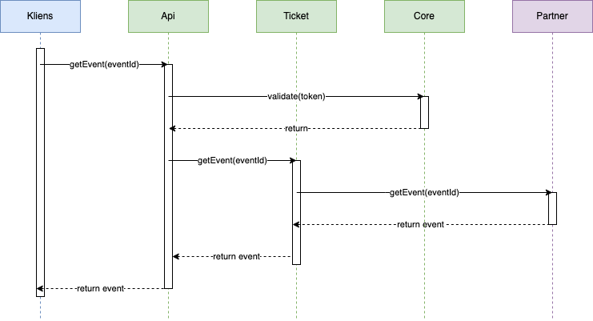
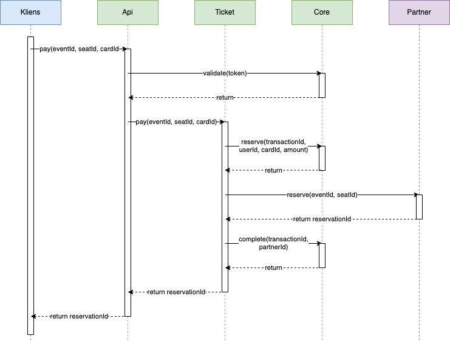

# Ticket Service

The Ticket Service application enables clients to browse available events and buy a ticket for seat on these events.

## Getting started

### Build services
To build all service run
`make build-all`

### Dockerize services
To create a docker image of all services run `make image-all`

### Running locally
Set `POSTGRES_USER` and `POSTGRES_PASSWORD` environment variables.

Run the `make run` command.

## Documentation

The application consists of three internal services and an external dummy partner.

### Components

#### API
An API Gateway that authenticates each requests before forwarding it to the Ticket service.

#### Ticket
The orchestration services that communicates with partners and manages payments transactions with Core.

#### Core
Responsible for validating users of the application and managing the balance of users and partners.

#### Partner
Manages its own evens.

### Workflow
The following diagrams show successful workflows.

#### /getEvents
Get all promoted events from every partner.

#### /getEvent
Get the seating details of a specific event.

#### /pay
Buy a ticket for a seat of a promoted event.

